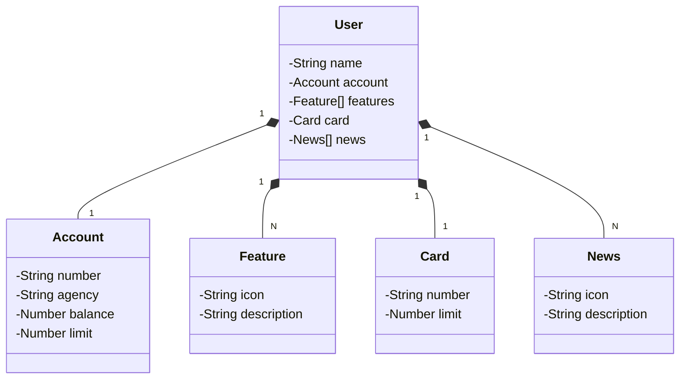

# RESTful API - JAVA
Criação de uma API REST com Spring Boot, Java e Railway, desenvolvido no módulo sobre Spring Boot do curso: **Bradesco - Java Cloud Native**, da *Digital Innovation One* (DIO).\
Código criado por [Venilton Falvo Jr - @falvojr](https://github.com/falvojr) nas aulas ministradas.

## Diagrama de Classes

